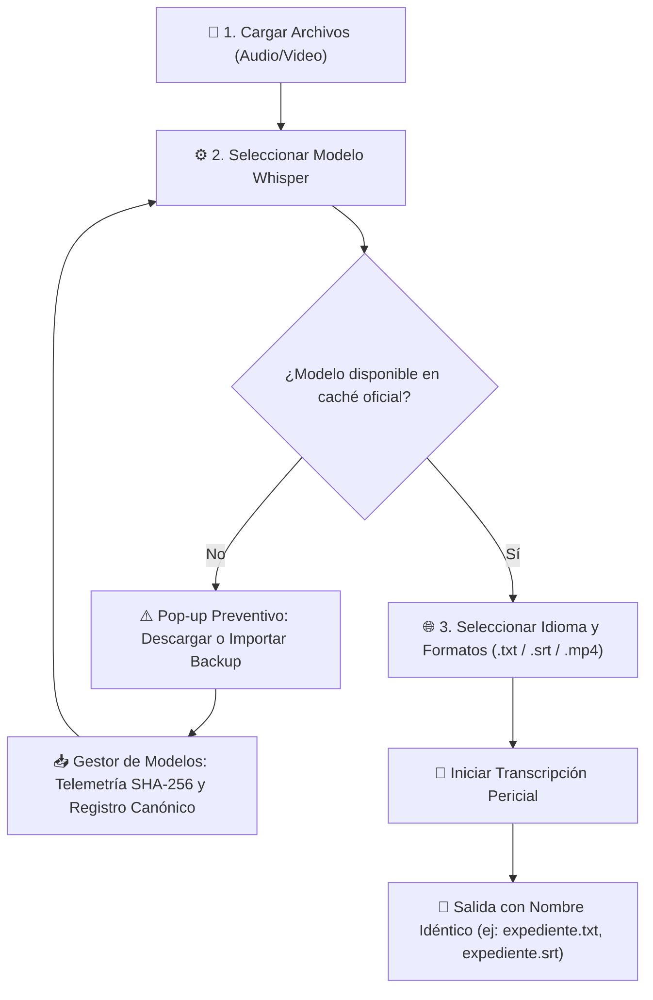

# ⚖️ Sephent Transcriptor

> **Herramienta pericial y profesional de transcripción, investigación y análisis documental de audio y video basada en OpenAI Whisper, Tauri y React.**

---

## 📋 Índice

1. [Descripción General](#-descripción-general)
2. [Propiedades del Programa](#-propiedades-del-programa)
3. [Ventajas Competitivas y Operativas](#-ventajas-competitivas-y-operativas)
4. [Arquitectura de Software y Patrones de Diseño](#-arquitectura-de-software-y-patrones-de-diseño)
5. [Identidad Visual: "Lexis & Archive"](#-identidad-visual-lexis--archive)
6. [Flujo de Trabajo Típico](#-flujo-de-trabajo-típico)
7. [Instalación y Puesta en Marcha](#-instalación-y-puesta-en-marcha)
8. [Estructura del Proyecto y Documentación](#-estructura-del-proyecto-y-documentación)
9. [Apoyo y Donaciones](#-apoyo-y-donaciones)

---

## 🔍 Descripción General

**Sephent Transcriptor** es una aplicación de escritorio de alto rendimiento diseñada específicamente para entornos que demandan **máxima confidencialidad, fidelidad probatoria y sobriedad ejecutiva**: despachos jurídicos, peritos judiciales, periodistas de investigación, consultores forenses e instituciones académicas.

A diferencia de las plataformas tradicionales basadas en la nube, Sephent Transcriptor opera **100% de manera local y fuera de línea (offline)**. El procesamiento de audio y video se ejecuta en la propia máquina del usuario mediante modelos oficiales de **OpenAI Whisper**, garantizando que los testimonios, grabaciones sensibles, actas notariales o entrevistas reservadas nunca abandonen el equipo de trabajo.

---

## ⚙️ Propiedades del Programa

### 1. Motor OpenAI Whisper Canónico y Gestión Inteligente de Rutas
- **Detección Automática de Rutas Oficiales:** El sistema reconoce automáticamente la carpeta canónica oficial utilizada por OpenAI Whisper según el sistema operativo (`~/.cache/whisper` en Windows, macOS y distribuciones GNU/Linux).
- **Inspección Previa y Reutilización:** Antes de iniciar cualquier descarga, verifica si los pesos del modelo ya existen en el sistema. Si ya están instalados (por ejemplo, mediante la CLI de Python o instalaciones previas de Whisper), se aprovechan inmediatamente sin requerir re-descargas.
- **Catálogo Exhaustivo de Modelos:** Soporte nativo para toda la jerarquía de modelos Whisper:
  - `tiny` (~75 MB) – Ultraligero para pruebas rápidas y recursos contenidos.
  - `base` (~145 MB) – Balance óptimo de velocidad y precisión general.
  - `small` (~466 MB) – Precisión elevada en múltiples idiomas.
  - `medium` (~1.46 GB) – Nivel pericial para audios con ruido de fondo o múltiples interlocutores.
  - `large-v3` (~2.94 GB) – Máxima precisión documental y reconocimiento fonético complejo.
  - `turbo` (~1.57 GB) – Velocidad acelerada con alta retención de exactitud semántica.

### 2. Prevención Criptográfica de Duplicados (SHA-256)
- **Ahorro Riguroso de Espacio en Disco:** Al cargar modelos de voz o importar copias de seguridad existentes (`.pt` o `.bin`), el motor calcula la firma criptográfica **SHA-256** del archivo.
- **Detección de Colisiones:** Si un archivo con la misma firma hash ya existe en la caché oficial, el sistema previene la duplicación, ahorrando gigabytes de almacenamiento y notificando pedagógicamente al usuario.

### 3. Nomenclatura Idéntica y Trazabilidad de Expedientes
- **Cero Pérdida de Referencia Documental:** Todo archivo de salida conserva estrictamente el **mismo nombre original del archivo procesado**, modificando únicamente su extensión según el formato elegido.
  - Ejemplo: `declaracion_testigo_causa_0412.mp3` generará `declaracion_testigo_causa_0412.txt`, `declaracion_testigo_causa_0412.srt` o `declaracion_testigo_causa_0412.mp4`.
- **Organización Automática de Evidencia:** Evita confusiones probatorias y facilita la incorporación directa de actas transcritas en carpetas judiciales o carpetas de investigación.

### 4. Generación Multiformato y Salidas Documentales
- **Texto Plano (`.txt`):** Transcripción limpia, corrida y fidedigna, adecuada para dictámenes, síntesis periciales y actas formales.
- **Subtítulos Estándar (`.srt`):** Segmentación cronometrada con milisegundos para su inserción en suites de edición de video, reproductores multimedia o presentaciones en audiencias.
- **Video Sintético con Meta-Imagen (`.mp4`):** Creación de un video contenedor con una meta-imagen pericial que resume los metadatos del expediente: fecha de procesamiento, duración, modelo empleado, top-10 palabras clave detectadas y cronomarcas relevantes.

### 5. Telemetría y Feedback en Tiempo Real
- **Barra de Descarga Interactiva:** Visualización transparente del proceso de descarga e instalación de modelos, indicando:
  - Porcentaje completado con animación de avance fluido.
  - Megabytes descargados y tamaño total.
  - Velocidad de transferencia en tiempo real (MB/s).
  - Tiempo restante estimado.
  - Fases de sincronización e integridad criptográfica.
- **Pop-ups Guía Preventivos:** Al seleccionar o intentar transcribir con un modelo aún no descargado, la interfaz despliega un cuadro de diálogo contextual que orienta al usuario para descargarlo de inmediato o acceder al Gestor de Modelos.

---

## 💎 Ventajas Competitivas y Operativas

| Ventaja | Impacto Operativo | Beneficio para el Usuario |
|---|---|---|
| **🔒 100% Local & Privacidad Absoluta** | Sin envío de paquetes a servidores externos ni APIs de terceros. | Cumplimiento estricto de secretos profesionales, secreto de sumario, normativas GDPR/HIPAA y confidencialidad pericial. |
| **📁 Reutilización del Ecosistema Whisper** | Comparte la ruta canónica `~/.cache/whisper`. | Si ya descargaste modelos con Python, scripts de bash u otras herramientas, Sephent los detecta y utiliza de inmediato. |
| **🛡️ Algoritmo Antiduplicados Inteligente** | Verificación SHA-256 previa al copiado de respaldos. | Evita saturar el disco rígido con réplicas redundantes de modelos que pesan entre 500 MB y 3 GB. |
| **📑 Consistencia Estricta de Salida** | Salidas con el mismo nombre que el archivo fuente original. | Simplifica la gestión de expedientes y el cotejo documental en audiencias y revisiones probatorias. |
| **⚡ Rendimiento y Ligereza Nativa** | Núcleo Tauri (Rust) + Frontend React/TypeScript. | Consumo mínimo de memoria RAM en comparación con soluciones infladas basadas en Electron clásico. |
| **📱 Accesibilidad Mobile First** | Adaptabilidad completa para pantallas táctiles y escritorios. | Permite su consulta o control en dispositivos portátiles o pantallas táctiles de campo con objetivos táctiles accesibles (WCAG). |

---

## 🏗️ Arquitectura de Software y Patrones de Diseño

El código base de Sephent Transcriptor fue estructurado aplicando rigurosamente los principios de ingeniería de software **SOLID**, **KISS** (*Keep It Simple, Stupid*) y **DRY** (*Don't Repeat Yourself*):

### 1. Principios SOLID
- **S - Single Responsibility Principle (SRP):**
  - `WhisperPathService`: Encargado exclusivamente de la resolución de rutas canónicas según el sistema operativo.
  - `DuplicateDetector`: Responsable únicamente del cómputo de firmas SHA-256 y detección de colisiones en disco.
  - `ModelManager`: Centraliza la gestión de estados, descargas y respaldos de modelos.
  - `TranscriptionService`: Fachada unificada encargada de coordinar las salidas documentales y nombres base.
- **O - Open/Closed Principle (OCP):**
  - Nuevos formatos de salida (ej. PDF forense, JSON estructurado, DOCX) pueden agregarse creando una nueva clase que implemente `OutputFormatStrategy` sin necesidad de modificar el servicio central de transcripción ni la interfaz de usuario.
- **L - Liskov Substitution Principle (LSP):**
  - Las estrategias `TxtFormatStrategy`, `SrtFormatStrategy` y `VideoFormatStrategy` son completamente intercambiables entre sí a través del contrato polimórfico común.
- **I - Interface Segregation Principle (ISP):**
  - Las interfaces están atomizadas y especializadas: `OutputFormatStrategy`, `TranscribeJobOptions`, `TranscriptionRecord`, `InformacionRutaOficial`. Ningún módulo depende de contratos inflados o métodos que no utiliza.
- **D - Dependency Inversion Principle (DIP):**
  - Los componentes de alto nivel dependen de abstracciones y fábricas (`OutputFormatFactory`), nunca de implementaciones concretas de formateo o codificación.

### 2. Patrones de Diseño Implementados
- **Strategy Pattern:** Encapsula la lógica de formateo y extensión de archivos (`TxtFormatStrategy`, `SrtFormatStrategy`, `VideoFormatStrategy`).
- **Factory Pattern:** `OutputFormatFactory` construye dinámicamente las estrategias correspondientes según las opciones elegidas por el usuario.
- **Facade Pattern:** `TranscriptionService` ofrece una API limpia y expresiva (`generateTranscriptionRecord`, `extractBaseName`) ocultando la complejidad de coordinación interna.

---

## 🎨 Identidad Visual: "Lexis & Archive"

Sephent Transcriptor adopta el sistema de diseño exclusivo **"Lexis & Archive"**, inspirado en la estética de los despachos jurídicos de alta jerarquía, el periodismo de archivo y las publicaciones editoriales especializadas:

- **Paleta Cromática Sobria y Ejecutiva:**
  - *Negro Obsidiana* (`#121212`) y *Carbón Profundo* (`#1C1C1A`) para superficies solemnes y barras de control.
  - *Blanco Roto / Pergamino* (`#FBFBF9`) y *Marfil* (`#F3F3EF`) para superficies de trabajo claras y de lectura descansada.
  - *Taupe / Arena Cálido* (`#B5A795`) para microinteracciones, acentos y resaltados discretos.
  - Supresión total de azules neón o colores saturados genéricos que distraigan la labor documental.
- **Jerarquía Tipográfica Editorial:**
  - Encabezados con serifas clásicas de corte jurisprudencial (`Newsreader`, `Georgia`, `Baskerville`).
  - Controles, botones y selectores en fuentes sans-serif nítidas de legibilidad óptima (`Inter`, `system-ui`).
  - Rutas de archivo y hashes en tipografía monospace técnica (`Cascadia Code`, `Consolas`).
- **Microinteracciones Guiadas:** Efectos hover sutiles con realce de borde y elevación sombreada controlada para una selección precisa de modelos y opciones.

---

## 🔄 Flujo de Trabajo Típico



---

## 🚀 Instalación y Puesta en Marcha

### Requisitos Previos
- **Node.js**: Versión 18 o superior.
- **NPM** o **Yarn**.
- **Rust & Cargo** (necesarios para compilación de binarios de escritorio Tauri).

### Instalación de Dependencias
```bash
npm install
```

### Ejecutar en Modo Desarrollo (Vite)
```bash
npm run dev
```

### Ejecutar con Tauri Desktop
```bash
npm run tauri:dev
```

### Ejecutar Suite de Pruebas Automatizadas
El proyecto incluye pruebas unitarias y de integración que validan rutas oficiales, cálculo SHA-256, prevención de duplicados y principios SOLID/Strategy:
```bash
npm test
```

### Compilar para Producción
```bash
npm run build
```

---

## 📁 Estructura del Proyecto y Documentación

Siguiendo el estándar de arquitectura y trazabilidad de `AGENTS.md`, el proyecto se organiza de la siguiente manera:

```text
sephent-transcriptor/
├── assets/                 # Recursos gráficos, íconos y plantillas visuales
├── dist-web/               # Artefactos compilados para la vista de usuario
├── docs/                   # Bitácora y documentación formal
│   ├── general-log.md      # Registro cronológico de cambios y decisiones técnicas
│   ├── bug-trace.md        # Trazabilidad acumulativa de defectos y folios de resolución
│   ├── resume.md           # Resumen de continuidad entre sesiones de desarrollo
│   ├── manual-usuario.md   # Guía operativa para el usuario final
│   └── requerimientos.md   # Especificaciones funcionales y periciales
├── src/
│   ├── components/         # Componentes React con estética "Lexis & Archive"
│   │   ├── TranscriptionPanel.tsx      # Panel principal de trabajo y configuración
│   │   ├── ModelManagerModal.tsx       # Gestor interactivo de modelos Whisper
│   │   ├── ModelNotDownloadedModal.tsx # Pop-up de advertencia preventiva
│   │   ├── DownloadProgressBar.tsx     # Barra de progreso con telemetría de descarga
│   │   └── DonateButton.tsx            # Botón discreto de agradecimiento y apoyo
│   ├── config/
│   │   ├── themeTokens.ts              # Tokens unificados de color, tipografía y sombras
│   │   └── whisperConfig.ts            # Catálogo oficial de modelos y especificaciones
│   ├── services/
│   │   ├── duplicateDetector.ts        # Cálculo SHA-256 y prevención antiduplicados
│   │   ├── modelManager.ts             # Lógica de instalación, verificación y backups
│   │   ├── whisperPathService.ts       # Detección canónica de rutas por sistema operativo
│   │   └── transcription/              # Arquitectura SOLID y Strategy Pattern
│   │       ├── formatStrategies.ts     # Estrategias de salida (.txt, .srt, .mp4)
│   │       ├── transcriptionService.ts # Fachada y extracción idéntica de nombres
│   │       └── types.ts                # Interfaces segregadas (ISP)
│   └── styles/
│       ├── global.css                  # Estilos globales y reset
│       ├── tokens.css                  # Variables CSS sincronizadas con tokens
│       └── responsive.css              # Arquitectura Mobile First y accesibilidad
├── tests/
│   ├── modelManager.test.ts            # 14 pruebas de rutas y antiduplicados
│   └── transcriptionService.test.ts    # 18 pruebas de Strategy, Factory y nombres
├── package.json
├── tsconfig.json
├── vite.config.ts
└── README.md
```

---

## ☕ Apoyo y Donaciones

Si este proyecto le resulta de utilidad para su labor jurídica, pericial o investigativa y desea respaldar su desarrollo continuo, puede realizar una donación voluntaria vía PayPal:

👉 **[Apoyar vía PayPal (@helltrader)](https://paypal.me/helltrader)**

---

## 📄 Licencia

Este software se distribuye con propósitos de investigación, desarrollo y asistencia pericial. Los modelos de voz subyacentes son propiedad y autoría de [OpenAI](https://github.com/openai/whisper) bajo su respectiva licencia de código abierto.
